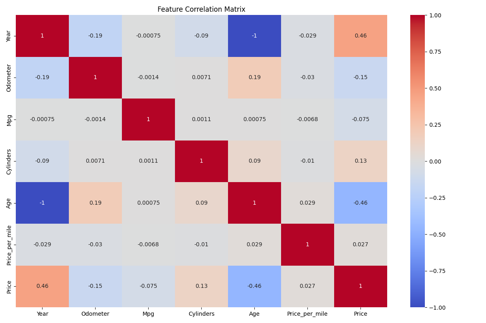

# The Guide 🚗

 &nbsp;
 &nbsp;
 

## Overview  
**The Guide 🚗** is a cutting-edge data science project leveraging machine learning to detect which car would be best for you. By analyzing a car inventory dataset, the model can proactively predict which car would be best for you based on what features you ask for.

This repository contains the source code, trained ML model, and related resources for the creation of the project.  

---

## Features  
- **Car Prediction**: Advanced machine learning algorithm trained on car inventory data.  
- **Price Prediction**: The project can estimate the price of a car based on selected attributes.  
- **Interactive Chatbot**: Engage with an intelligent chatbot to ask questions about cars, features, and recommendations.  
- **Car Attribute Chooser**: A user-friendly interface to customize and choose car attributes for tailored predictions.  

---

## Presentation  
You can view the project presentation [here](https://docs.google.com/presentation/d/1Q1pjIl9ssAA49cWzYJy-AP-iywf1TJm26GihRztmcjU/edit?usp=sharing).  

---

## Technologies Used  
- **Programming Language**: Python  
- **Machine Learning Frameworks**: Scikit-learn
- **Data Processing**: Pandas, NumPy  
- **Visualization**: Matplotlib
- **API**: OpenAI

---

## Acknowledgments  
- **Contributors**:  Esteban Mesa, Samith Hasan, Ibrahim Faruqee
- **Dataset Source**: [Used Cars Dataset](https://www.kaggle.com/datasets/austinreese/craigslist-carstrucks-data) & [Vehicle Dataset 2024](https://www.kaggle.com/datasets/kanchana1990/vehicle-dataset-2024)
- **Inspiration**: Trouble choosing which car to buy 😭

---

## License  
This project is licensed under the [MIT License](LICENSE).  
Feel free to use, modify, and distribute this project in accordance with the terms specified.  

